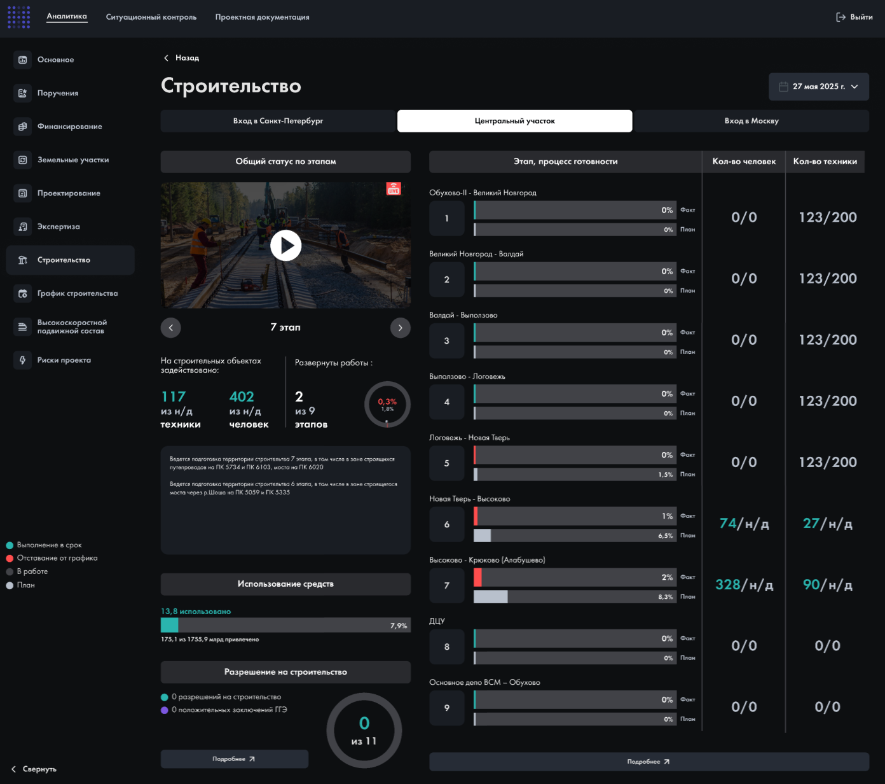
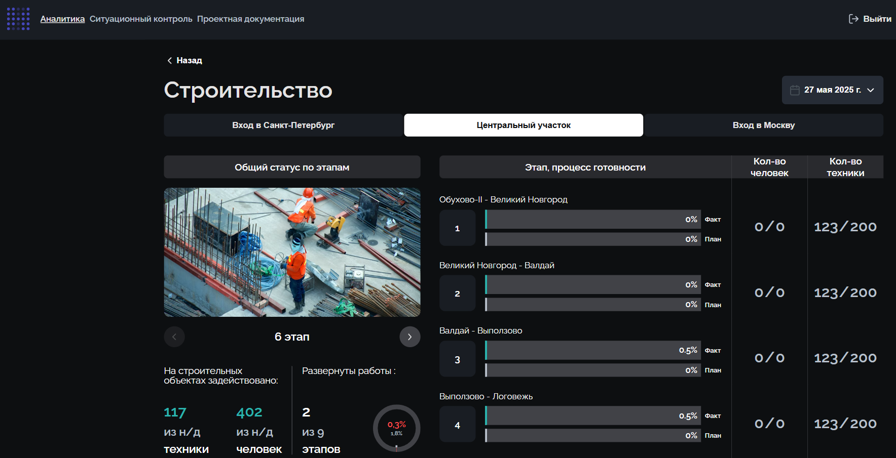
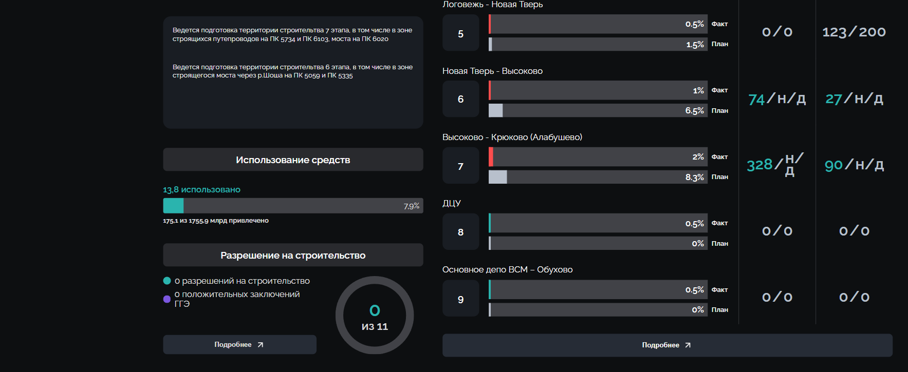

# Тестовое задание: Frontend-разработчик (Vue.js)

Реализация дашборда «Строительство» на основе предоставленного макета Figma для Центра цифровых высокоскоростных транспортных систем РУТ (МИИТ).

**Главная цель задания:** Продемонстрировать навыки семантической верстки, умение грамотно выстраивать разметку интерфейса (layout) с помощью Flexbox и CSS Grid, а также строгое следование методологии БЭМ во фреймворке Vue 3.

## Результат работы

### Ожидание (Макет Figma):

### Итоговая реализация (с учетом прокрутки):

## Стек технологий
* **Vue 3** (Composition API)
* **CSS3** (Flexbox, CSS Grid, CSS-переменные)
* **Методология БЭМ** для строгой и читаемой структуры классов
* **Шрифт:** Raleway

## Что было реализовано

Согласно техническому заданию и макету, были выполнены следующие задачи:

1. **Разметка и верстка (HTML/CSS):**
   - Интерфейс разбит на логические изолированные компоненты (`Header`, `SideBar`, `ContentArea`, `ContentLeft`, `ContentRight` и др.).
   - Выстроена сложная сетка дашборда с активным использованием `CSS Grid` и `Flexbox`. 
   - Настроено поведение колонок (Fluid Layout) для корректного отображения на десктопном разрешении (1920px).
   - Классы написаны строго по БЭМ (Блок, Элемент, Модификатор).

2. **Работа с данными (Vue.js):**
   - Данные для правой таблицы (этапы, проценты, количество техники и людей) вынесены в реактивные массивы (`ref`).
   - Отрисовка списков реализована через директиву `v-for`.
   - Настроено динамическое применение классов и стилей (изменение цвета прогресс-бара и статусного маркера в зависимости от значения).

3. **Слайдер изображений:**
   - Видеоплеер из макета заменен на функциональный слайдер с фотографиями этапов строительства.
   - Реализована логика переключения слайдов (вперед/назад).
   - Кнопки навигации автоматически блокируются (`:disabled`), если достигнут конец или начало массива изображений.

4. **UI-элементы и детали:**
   - Дата реализована как статический элемент согласно ТЗ.
   - Настроена единая система управления дизайн-токенами (цвета, фоны) через CSS-переменные (`:root`).
   - Интегрирована сложная логика отрисовки прогресс-баров: разделение маркеров факта и плана, корректная отработка нулевых значений.